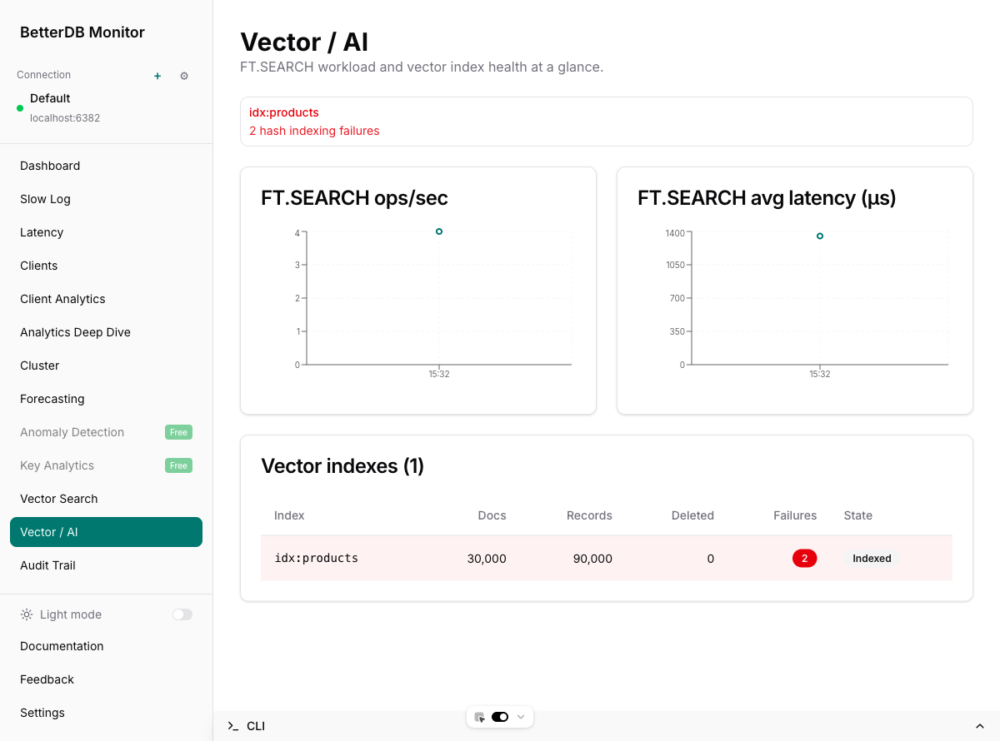
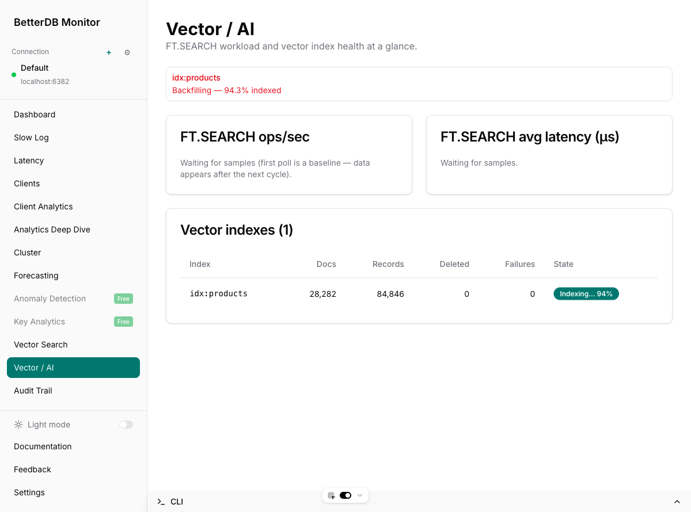
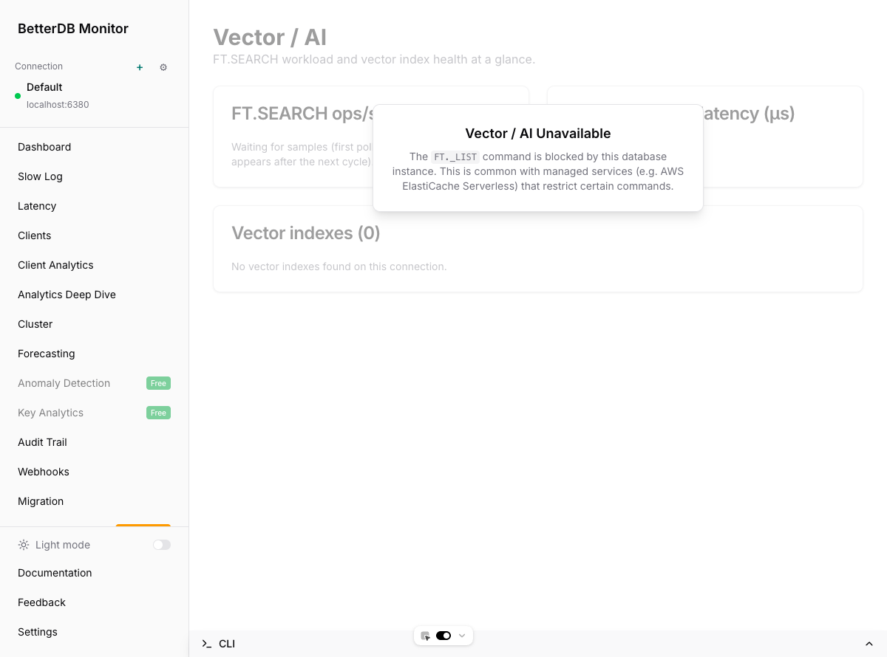

# Vector / AI

BetterDB Monitor's **Vector / AI** tab gives you a single view of vector-index health and FT.SEARCH workload on any Valkey or Redis instance that has the Search module loaded. It's built for teams running semantic search, retrieval-augmented generation, or any pipeline where the vector index is the hot path.

## Requirements

The tab appears automatically when the connected database exposes the Search module:

- **Redis 8.0+** — RediSearch is bundled by default
- **Valkey 8 with [`valkey-search`](https://github.com/valkey-io/valkey-search)** — module loaded at startup
- **Managed services** — any offering that keeps `FT._LIST`, `FT.INFO`, `FT.SEARCH` available

If the module isn't loaded (or the command is restricted), the tab hides from the sidebar and the direct URL shows an explanatory overlay. See [Unavailable state](#unavailable-state).

## The dashboard at a glance

Four regions, top to bottom:

1. **Header** — feature title and one-liner
2. **Health alerts** — only rendered when at least one condition is true; otherwise it's absent
3. **FT.SEARCH ops/sec and avg latency charts** — rolling 1-hour window, refreshes every 15 s
4. **Vector indexes table** — one row per index on the current connection, refreshes every 30 s

## Health alerts

Surfaces three classes of problem per index:

| Condition | Alert text | When it fires |
|---|---|---|
| `indexingFailures > 0` | `<index> — N hash indexing failure(s)` | The cumulative count of docs the server rejected because their indexed field didn't match the schema (e.g. a 9-byte string where a 128-float vector was expected) |
| `indexingState != 'indexed'` and `percentIndexed < 100` | `<index> — Backfilling — XX.X% indexed` | An index is still catching up on its prefix — present during initial backfill and after any operation that invalidates the index |
| `numDeletedDocs > 0` | `<index> — N deleted docs accumulating` | Tombstones from partial or failed in-place updates; a non-zero value hints at wasted memory until the index is compacted |

Any non-zero alert uses the destructive variant so it stands out against the rest of the page.

## The charts

Both charts consume `/metrics/commandstats/ft.search/history`, which stores per-poll deltas of Valkey's `INFO commandstats` section:

- **ops/sec** = `callsDelta / (intervalMs / 1000)`
- **avg latency (µs)** = `usecDelta / max(callsDelta, 1)`

Delta sampling means:

- The first poll writes nothing (baseline only) — on a freshly started API you'll see a short "Waiting for samples" message until the second poll lands
- Zero-delta samples are dropped, so the chart is free of flat idle points
- `CONFIG RESETSTAT` is detected (current counter < previous) and triggers a re-baseline without writing a bogus negative sample

## The index table

Each row reports the live state from `FT.INFO` plus a few persisted fields:

| Column | Source | Notes |
|---|---|---|
| **Index** | `name` | Monospaced so long names don't wrap awkwardly |
| **Docs** | `num_docs` | Docs currently addressable by `FT.SEARCH` |
| **Records** | `num_records` | Underlying records (typically docs × indexed fields) |
| **Deleted** | `num_deleted_docs` | Tombstones from in-place updates; RediSearch-specific, reports 0 on valkey-search |
| **Failures** | `hash_indexing_failures` | Red destructive Badge when non-zero; pink row tint |
| **State** | `indexingState` + `percentIndexed` | `Indexed` secondary Badge when settled, brand-colored `Indexing… XX%` Badge while backfilling |

### Indexing in progress

When a new index is created over an existing prefix, the row shows the backfill progress live:

Creating an HNSW index over 30,000 128-dim vectors above took about 21 s on a dev machine. Both the alert strip and the badge flip to the settled `Indexed` state once `percent_indexed` reaches 1.0.

## Unavailable state

On a database without the Search module, the sidebar hides both the `Vector Search` and `Vector / AI` links and the direct URL renders an explanatory overlay:

The wording covers both realistic causes: the module isn't loaded on a plain Valkey or Redis build, or `FT._LIST` is restricted by a managed service like AWS ElastiCache Serverless.

## Under the hood

The tab is a thin consumer of three backend pieces:

| Concern | Endpoint | Poller |
|---|---|---|
| Index list | `GET /vector-search/indexes` | `VectorSearchService`, 30 s |
| Per-index live info | `GET /vector-search/indexes/:name` | Same |
| Historical snapshots | `GET /vector-search/indexes/:name/snapshots` | Persisted to `vector_index_snapshots` every 30 s, retained 7 days |
| Command workload | `GET /metrics/commandstats/:command/history` | `CommandstatsPollerService`, 15 s, persisted to `command_stats_samples`, retained 7 days |

Prometheus scraping is supported via `/prometheus/metrics` with these gauges, labelled by `connection` and `index`:

- `betterdb_vector_index_docs`
- `betterdb_vector_index_memory_bytes`
- `betterdb_vector_index_indexing_failures`
- `betterdb_vector_index_percent_indexed`

Stale labels are pruned when an index disappears between polls, so dropped indexes stop reporting automatically.

## Troubleshooting

**The tab is missing from the sidebar.**
The current connection doesn't expose `FT._LIST`. Confirm with `MODULE LIST` or `FT._LIST` on the server. If you're on managed Redis/Valkey, check whether the provider restricts `FT.*`.

**Charts stay on "Waiting for samples" for longer than a minute.**
The commandstats poller runs every 15 s but the first poll is always a baseline. If there's still nothing after the second cycle, confirm the Valkey/Redis instance is actually serving FT.SEARCH traffic — zero-delta commands are dropped by design. Also confirm `CommandstatsPollerService` is wired up in your deployment (`pnpm dev` or production image).

**A `Failures` badge shows a non-zero count.**
That's the raw `hash_indexing_failures` counter. Check recent application writes targeting that index's prefix — the usual cause is a schema mismatch (vector bytes of the wrong length, non-numeric value in a NUMERIC field, etc.). The counter never resets until the index is dropped and recreated, so fix the offending writer first, then `FT.DROPINDEX` + re-`FT.CREATE` to clear it.

**Indexing progress seems stuck.**
If `percent_indexed` isn't moving across multiple polls, the server may be rate-limited on indexing (large key count, large vector dimension, constrained CPU). Inspect `FT.INFO <index>` directly — look at `indexing_failures` and, on RediSearch, `gc_stats`.

## Feature history

- Original discussion: project-board draft item **"Vector / AI tab in the monitor UI"** (databaseId 175680694)
- Backend groundwork shipped in [#111](https://github.com/BetterDB-inc/monitor/pull/111): extended `VectorIndexSnapshot`, Prometheus vector gauges, commandstats time-series endpoint
- UI shipped in [#112](https://github.com/BetterDB-inc/monitor/pull/112) and documented here
